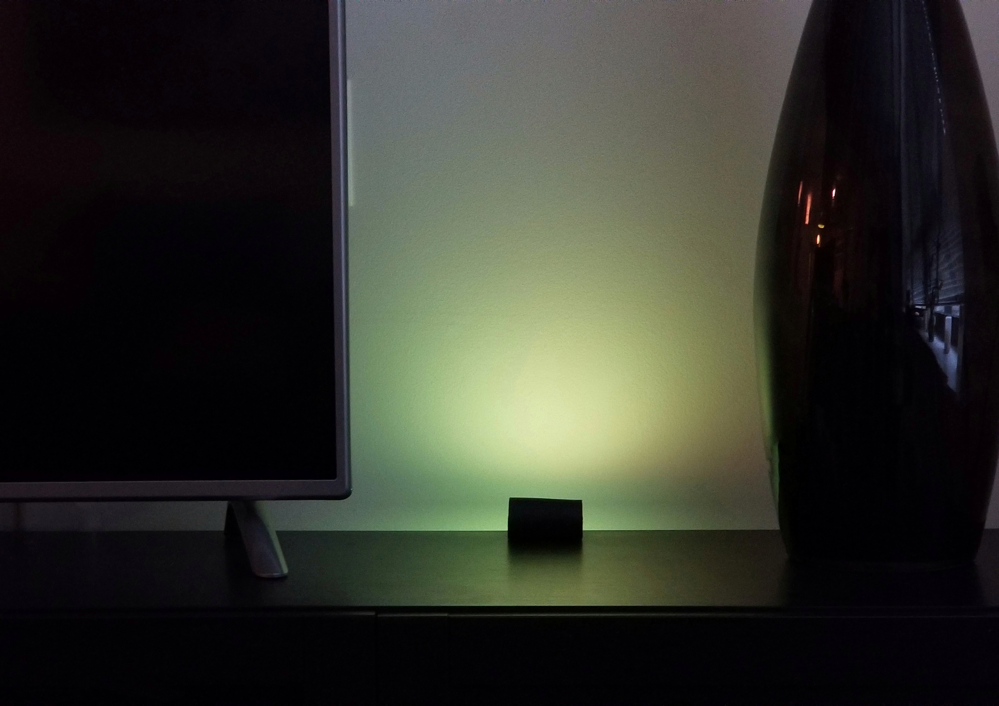

# raspi-thc
Raspberry Pi Zero W - Time Hacker Clock

A Time Hacker Clock is a device based on the Time Hacker Method (THM). THM combines simple productivity guidelines with shapes or colors to quickly convey how much time remains in a given day or time block.

This version of the clock uses a Raspberry Pi Zero and a light strip to cast color onto a nearby wall.  The colors used from the [HSV color space](https://en.wikipedia.org/wiki/HSL_and_HSV), essentially 120 degrees of colors in the range of green to red.



Communication with the clock is done via a WiFi connection using a web browser and simple API.


## Setup

### Hardware

This version of the Timer Hacker Clock requires a [Raspberry Pi Zero W](https://www.raspberrypi.org/products/raspberry-pi-zero-w/) (WiFi) computer and a [Pimoroni Blinkt light strip component](https://shop.pimoroni.com/products/blinkt). Both the Raspberry Pi and the Blinkt are available in the US from Amazon and [Adafruit](https://www.adafruit.com/product/3195).

### Assembly

I found a Pi Zero case from iUniker which proved ideal given its GPIO opening on the top of the case.


That allowed the Blinkt light strip to sit nicely on top of the case.  To make this work though, I had to use a combination of a double row female pin header and a double row header strip.


The block header is soldered to the Pi Zero and the double row header strip is placed long side in.


I needed a way of refecting the extremely bright LEDs so that the unit can sit on desk and only cast light onto a wall. I found some heat strink tubing lying around and figured I could cut it and line the inside with alluminum foil. Bonding glue held the piece together connected it to the front for the case.


* Case: http://a.co/d/hf4pVjN
* Wall Heat Shrink Tubing: http://a.co/d/dQBUwDg

### Software Setup

Setup the Raspberry Pi Zero W using [Raspbian Lite](https://www.raspberrypi.org/downloads/raspbian/).  Make sure to configure your current locale using raspi-config and enable WiFi settings.

This THC also requires NodeJS.  For the Pi Zero W you'll need a version of Node for the ARMv6 processor. Check the [NodeJS distribution site](https://nodejs.org/en/download/) for a link to the latest verion in the Linux Binaries (ARM) section. Right click on the ARMv6 link to grab its URL. Then use a script similar to the one below on the Pi Zero.

```shell
$ wget https://nodejs.org/dist/v6.9.1/node-v6.9.1-linux-armv6l.tar.xz
$ mkdir nodejs
$ cd nodejs/
$ mv ../node-v6.9.1-linux-armv6l.tar.xz .
$ tar -xvf node-v6.9.1-linux-armv6l.tar.xz
$ cd node-v6.9.1-linux-armv6l/
$ sudo cp ./bin/* /usr/local/bin
```

With NodeJS installed you can pull this repo onto the Pi using:

```shell
$ git clone https://github.com/pnxtech/raspi-thc.git
$ cd raspi-thc
```

Then run the setup script:

```shell
$ ./setup.sh
```
