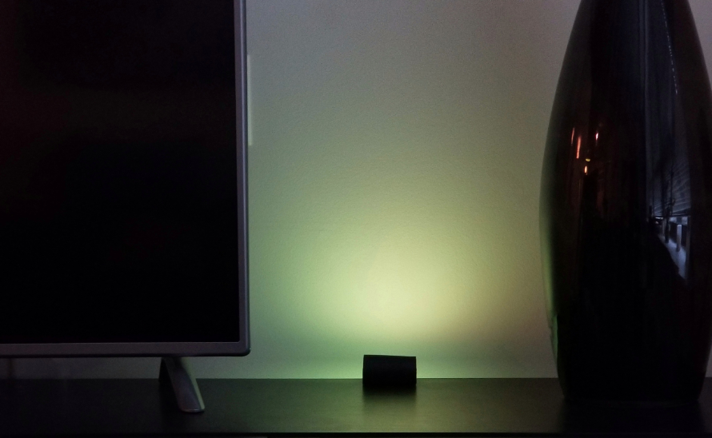

# raspi-thc
Raspberry Pi - Time Hacker Clock

A Time Hacker Clock is a device based on the Time Hacker Method (THM). THM combines simple productivity guidelines with devices that emit shapes or colors to quickly convey how much time remains in a given day or time block.

This version of the clock uses a Raspberry Pi Zero and a light strip to cast color onto a nearby wall.

The colors used are from the [HSV color space](https://en.wikipedia.org/wiki/HSL_and_HSV), essentially the colors from green to red in a 120-degree range.  A green light represents having more available time and a red light indicates the available time is expiring.

Communication with the clock is done via a WiFi connection using a web browser and simple API.

## Build your own device

This version of the Timer Hacker Clock requires a [Raspberry Pi Zero W](https://www.raspberrypi.org/products/raspberry-pi-zero-w/) (WiFi) SBC and a [Pimoroni Blinkt light strip component](https://shop.pimoroni.com/products/blinkt). Both the Raspberry Pi and the Blinkt are available in the US from Amazon and [Adafruit](https://www.adafruit.com/product/3195).

Review these docs to build your own version.

* [Build](./docs/assembly.md)
* [Setup Pi W](./docs/pi-setup.md)
* [Install software](./docs/software.md)
* [Controlling the clock](./docs/controlling.md)
