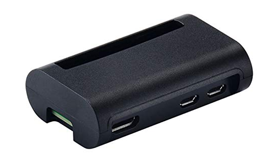

# Hardware assembly

I found a Pi Zero case from iUniker which proved ideal given its GPIO opening on the top of the case.

That allowed the Blinkt light strip to sit nicely on top of the case.  To make this work though, I had to use a combination of a double row female pin header and a double row header strip.

The block header is soldered to the Pi Zero and the double row header strip is placed long side in.

I needed a way of refecting the extremely bright LEDs so that the unit can sit on desk and only cast light onto a wall. I found some heat strink tubing lying around and figured I could cut it and line the inside with alluminum foil. Bonding glue held the piece together connected it to the front for the case.

* Case: http://a.co/d/hf4pVjN
* Wall Heat Shrink Tubing: http://a.co/d/dQBUwDg

---

[Return to main](../README.md) | [Build](../docs/assembly.md) | [Setup Pi W](../docs/pi-setup.md) | [Install software](../docs/software.md) | [Controlling the clock](../docs/controlling.md)
